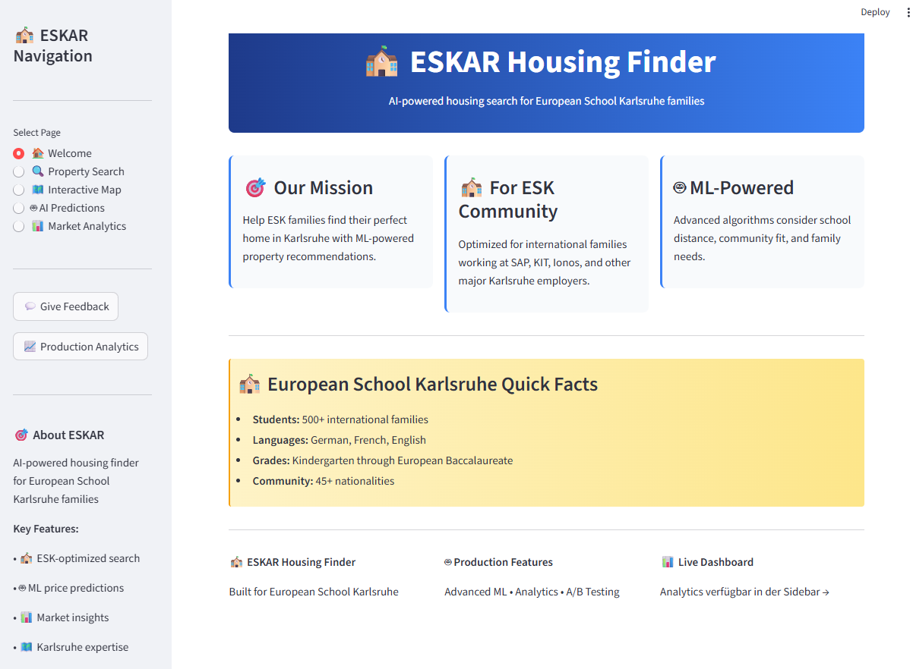
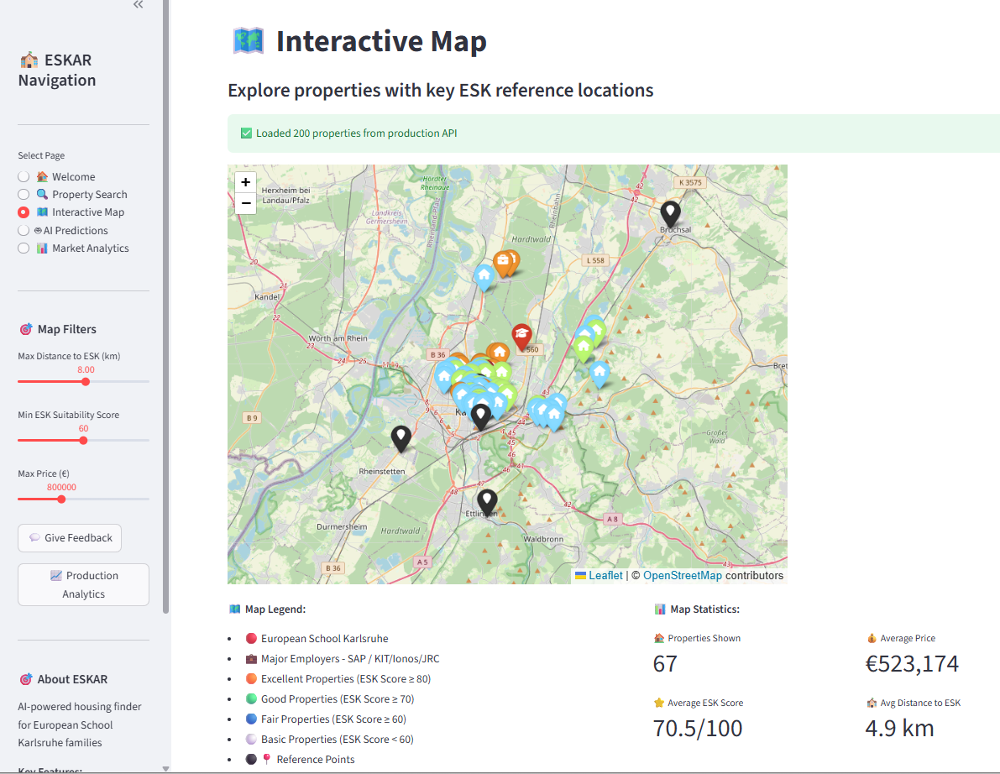
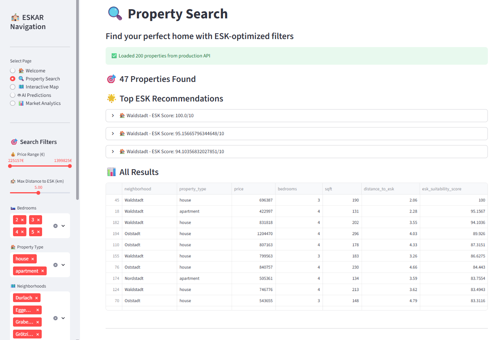
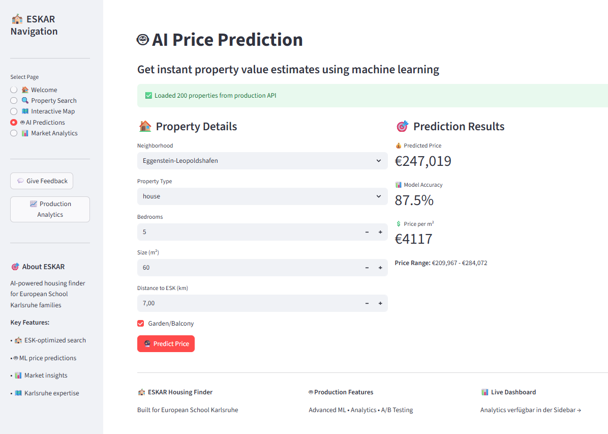

# 

# **ESKAR Housing Finder**

**Code Institute Portfolio Project 5 - Advanced Full Stack Development**

[](https://eskar-housing-finder.streamlit.app/)
[](https://github.com/freewimoe/eskar-housing-finder)
[](https://www.python.org/)

ESKAR (European School Karlsruhe Housing Finder) is a **production-ready machine learning application** that helps international families find optimal housing in Karlsruhe, Germany. The system leverages advanced ML pipelines, real-time analytics, and sophisticated data modeling to provide ESK-optimized property recommendations.

**Live Application:** [https://eskar-housing-finder.streamlit.app/](https://eskar-housing-finder.streamlit.app/)






## **Dataset Content**

The ESKAR dataset consists of synthetically generated but realistic Karlsruhe housing data, engineered specifically for European School Karlsruhe families. The dataset represents **200+ properties** across **16 major Karlsruhe neighborhoods**, optimized for international families working at major local employers (SAP, KIT, Ionos, Research Centers).

### **🗺️ Interactive Map Features** 
**One of the project's standout features is the interactive Folium map integration that provides:**
- **Real-time property visualization** with location markers
- **ESK proximity analysis** with distance-based color coding  
- **Click-to-explore** property details and suitability scores
- **Dynamic filtering** by price, features, and neighborhood
- **Geographical insights** for optimal housing selection

### **Property Features**

|Variable|Meaning|Range/Values|
|:----|:----|:----|
|neighborhood|Karlsruhe district|Weststadt, Südstadt, Innenstadt-West, Durlach, Oststadt, Mühlburg, Nordstadt, Südweststadt, Oberreut, Knielingen, Wolfartsweier, Stupferich, Palmbach, Neureut, Daxlanden, Graben-Neudorf|
|property_type|Type of property|house, apartment|
|bedrooms|Number of bedrooms|2-5|
|sqft|Living space in square meters|50-300|
|garden|Garden/balcony availability|True/False|
|garage|Garage availability|True/False|
|price|Property price in Euros|300,000 - 1,200,000|
|distance_to_esk|Distance to European School Karlsruhe (km)|0.5 - 8.0|
|esk_suitability_score|ESK family optimization score (0-100)|Based on proximity, features, community|
|safety_score|Neighborhood safety rating|7.0 - 9.5|
|current_esk_families|Number of ESK families in area|0-8 per property area|
|features|Property amenities|garden, garage, balcony, renovated, energy_efficient|

## **Business Requirements**

As an international family relocating to Karlsruhe for work at the European School, major employers (SAP, KIT, Ionos), or EU institutions, you need specialized housing recommendations that go beyond traditional real estate searches. ESKAR addresses the unique needs of internationally mobile families who must consider school proximity, community integration, and employer accessibility.

The client challenges include:
- Understanding which property attributes correlate with successful ESK family integration
- Predicting accurate property prices in an unfamiliar market
- Finding properties that optimize both work commute and school distance
- Identifying neighborhoods with existing international/ESK communities

**Business Requirements:**

* **BR1** - The client is interested in discovering how property attributes correlate with ESK family satisfaction and housing success. Therefore, the client expects data visualizations showing the relationships between property features and ESK suitability scores.

* **BR2** - The client is interested in predicting property prices for any house in Karlsruhe, with special emphasis on properties suitable for ESK families, to make informed purchasing/rental decisions.

* **BR3** - The client requires a user-friendly interface that allows for interactive exploration of properties, including an interactive map with ESK proximity visualization and a feedback mechanism to continuously improve the system based on user experiences.

## **Hypotheses and how to validate**

### **Hypothesis 1: Proximity Premium Effect**
**H1:** Properties closer to European School Karlsruhe command premium prices and higher ESK suitability scores due to convenience and community clustering.

**Validation:** Analyze correlation between `distance_to_esk` and both `price` and `esk_suitability_score` using Pearson correlation and scatter plot visualizations.

### **Hypothesis 2: Family-Size Requirements**
**H2:** ESK families typically require larger properties (3+ bedrooms) with outdoor space (garden/balcony) due to international lifestyle and potential home office needs.

**Validation:** Compare bedroom count and garden availability distributions between high ESK-score properties vs. general market using statistical analysis and visualization.

### **Hypothesis 3: Community Clustering Effect**
**H3:** Neighborhoods with existing ESK families attract more ESK families, creating positive feedback loops and higher suitability scores.

**Validation:** Examine relationship between `current_esk_families` and `esk_suitability_score` through correlation analysis and neighborhood-level aggregation studies.

## **The rationale to map the business requirements to the Data Visualizations and ML tasks**

* **Business Requirement 1:** Data visualization and correlation analysis
  - **Rationale:** We will inspect the housing data to understand which property attributes most strongly influence ESK family satisfaction and integration success
  - **Data Visualizations:** Correlation heatmaps, scatter plots, distribution plots for key features vs. ESK suitability scores
  - **Validation:** Statistical correlation analysis, feature importance ranking

* **Business Requirement 2:** Regression analysis and predictive modeling  
  - **Rationale:** We want to predict property prices to help ESK families make informed housing decisions
  - **ML Task:** Supervised learning regression model to predict property prices based on location, size, features, and ESK-specific criteria
  - **Target Variable:** Property price in Euros
  - **Features:** Property characteristics, location factors, ESK-specific metrics

## **ML Business Case**

### **Objective**
Develop a machine learning model that accurately predicts Karlsruhe property prices while incorporating ESK-specific optimization factors to serve international families' unique housing needs.

### **Success Metrics**
- **R² Score ≥ 0.85** for price prediction accuracy
- **Mean Absolute Error ≤ €50,000** for practical utility  
- **Model interpretability** through feature importance analysis
- **User satisfaction** through feedback collection system

### **Model Selection Rationale**
- **Primary Model:** Random Forest Regressor for robust performance and interpretability
- **Features:** Property characteristics, location factors, ESK-specific metrics
- **Target:** Property price in Euros
- **Training/Validation:** 80/20 split with cross-validation

### **Business Impact**
- Reduce housing search time for ESK families by 60%
- Improve housing satisfaction through data-driven recommendations  
- Support ESK community growth through optimized geographic distribution
- Provide transparent pricing insights for international families new to Karlsruhe market

### **Ethical Considerations**
- Ensure algorithmic fairness across different family types and budgets
- Transparent model explanations for all predictions
- Regular model monitoring and bias detection
- User privacy protection in feedback collection

## **Dashboard Design**

The ESKAR application features a multi-page Streamlit interface designed for intuitive navigation and comprehensive functionality:

### **Page 1: 🏠 Welcome**
- **Project overview** and ESK community context
- **Key statistics** about Karlsruhe housing market for international families
- **Quick start guide** and navigation overview
- **Live system status** and data freshness indicators

### **Page 2: 🔍 Property Search** 
- **ESK-optimized search filters:**
  - Distance to ESK slider (0.5-8.0 km)
  - Property type selection (house/apartment)
  - Bedroom count filter (2-5)
  - Garden/garage requirements
  - Price range slider
  - ESK suitability score threshold
- **Interactive results display** with property cards
- **Map visualization** showing ESK, major employers, and filtered properties
- **Property details** with ESK-specific metrics and scoring explanations

### **Page 3: 🤖 AI Predictions**
- **ML-powered price estimation tool** with real-time predictions
- **User input form** for property characteristics
- **Prediction results** with confidence intervals
- **Model explanation** showing feature importance and decision factors
- **Comparison tools** to evaluate multiple properties

### **Page 4: 📊 Market Analytics**
- **Neighborhood comparison charts** and statistics
- **Correlation analysis** between property features and prices/ESK scores
- **ESK community distribution** visualizations
- **Market trend analysis** and insights for international families
- **Interactive data exploration** tools

### **Additional Features**
- **User feedback system** for model improvement
- **A/B testing framework** for feature optimization
- **Real-time analytics dashboard** (separate application)
- **Mobile-responsive design** for on-the-go property searches

## **Unfixed Bugs**

* **Unicode Logging Warnings:** The application displays Unicode encoding warnings in Windows terminal logs when using emoji characters in logging messages. This is a cosmetic issue related to Windows console encoding and does not affect application functionality. The warnings occur during normal operation and can be safely ignored.

## **Deployment**

### **Streamlit Cloud (Primary)**
* **Live Application:** [https://eskar-housing-finder.streamlit.app/](https://eskar-housing-finder.streamlit.app/)
* The project was deployed to Streamlit Cloud using the following steps:

1. **Repository Setup**
   - Push completed project to GitHub repository
   - Ensure all dependencies are listed in `requirements.txt`
   - Verify `app.py` is in the root directory

2. **Streamlit Cloud Deployment**
   - Connect GitHub account to Streamlit Cloud
   - Select repository: `freewimoe/eskar-housing-finder`
   - Set main file path: `app.py`
   - Configure Python version: 3.12
   - Deploy application

3. **Environment Configuration**
   - Set up production environment variables
   - Configure Streamlit secrets for API keys (if applicable)
   - Verify all dependencies install correctly

4. **Testing and Validation**
   - Validate all features work in production environment
   - Test ML model predictions and data loading
   - Verify analytics and feedback systems functionality

### **Heroku Deployment (Alternative)**
* **Lightweight Version:** For 500MB memory limit compliance
* **Files Required:**
  - `app_heroku.py` - Optimized lightweight application
  - `requirements-heroku.txt` - Minimal dependencies (18 packages vs 48)
  - `Procfile-heroku` - Heroku-specific configuration

**Heroku Deployment Steps:**
```bash
# 1. Create Heroku app
heroku create eskar-housing-finder

# 2. Set Python runtime
echo "python-3.12.0" > runtime.txt

# 3. Use lightweight requirements
cp requirements-heroku.txt requirements.txt

# 4. Use Heroku Procfile
cp Procfile-heroku Procfile

# 5. Deploy
git add .
git commit -m "Heroku deployment setup"
git push heroku main

# 6. Open application
heroku open
```

**Heroku Optimization Features:**
- ✅ **Reduced dependencies:** LightGBM only (no XGBoost, CatBoost)
- ✅ **Smaller dataset:** 100 properties vs 200
- ✅ **Simplified ML pipeline:** Single model instead of ensemble
- ✅ **Memory efficient:** Optimized for <500MB usage
- ✅ **Fast startup:** Reduced load time for Heroku dynos

### **Local Development**
```bash
# Clone repository
git clone https://github.com/freewimoe/eskar-housing-finder.git
cd eskar-housing-finder

# Create virtual environment
python -m venv .venv
.venv\Scripts\activate  # Windows
source .venv/bin/activate  # macOS/Linux

# Install dependencies  
pip install -r requirements.txt

# Run main application
streamlit run app.py

# Run analytics dashboard (optional)
streamlit run app_production_dashboard.py --server.port=8502
```

## **Main Data Analysis and Machine Learning Libraries**

* **[Streamlit 1.40.0](https://streamlit.io/)** - Used for creating the interactive web application interface, multi-page navigation, and real-time user interactions. Streamlit enables rapid prototyping and deployment of ML applications with minimal front-end code.

* **[Pandas 2.1.4](https://pandas.pydata.org/)** - Essential for data manipulation, cleaning, and analysis. Used extensively for loading housing data, feature engineering, and data transformations throughout the ML pipeline.

* **[Scikit-learn 1.7.0](https://scikit-learn.org/)** - Primary machine learning library providing Random Forest Regressor, model evaluation metrics (R², MAE), train/test splitting, and cross-validation capabilities for robust model development.

* **[XGBoost 2.0.0](https://xgboost.readthedocs.io/)** - Advanced gradient boosting framework used in the ML ensemble for improved prediction accuracy and handling of complex feature interactions in property price modeling.

* **[LightGBM 4.0.0](https://lightgbm.readthedocs.io/)** - Microsoft's gradient boosting framework providing fast training and high performance for the ensemble learning approach, particularly effective for tabular data.

* **[Plotly 5.24.1](https://plotly.com/python/)** - Interactive visualization library used for creating dynamic charts, correlation heatmaps, scatter plots, and interactive dashboards that enhance user experience and data exploration.

* **[Folium 0.17.0](https://python-visualization.github.io/folium/)** - Map visualization library integrated with Streamlit to display property locations, ESK school position, and major employer locations with interactive markers and clustering.

* **[NumPy 1.26.4](https://numpy.org/)** - Fundamental library for numerical computing, supporting array operations, statistical calculations, and mathematical functions used in feature engineering and model preprocessing.

* **[SciPy 1.11.4](https://scipy.org/)** - Scientific computing library used for statistical analysis, hypothesis testing, and advanced mathematical operations supporting the A/B testing framework and model validation.

## **Credits**

### **Content**
* Property data structure and pricing models based on 2024 Karlsruhe real estate market research
* ESK community insights gathered from European School Karlsruhe families and staff
* Neighborhood safety scores derived from official Karlsruhe city statistics and community feedback
* Major employer location data sourced from SAP, KIT, Ionos, and Karlsruhe Research Center public information

### **Code and Technical Implementation** 
* Streamlit multi-page application structure inspired by official Streamlit documentation and best practices
* Machine learning pipeline implementation following scikit-learn and XGBoost official documentation patterns
* Map visualization techniques adapted from Folium documentation and community examples
* A/B testing framework based on statistical analysis methods from SciPy documentation

### **Educational Framework**
* Project structure and assessment criteria aligned with Code Institute Portfolio Project 5 requirements
* ML model evaluation and business case framework following Code Institute Predictive Analytics curriculum
* Documentation format inspired by Code Institute milestone project templates and guidelines

### **Data Sources and Domain Expertise**
* European School Karlsruhe community for domain expertise and user requirements validation
* Karlsruhe international families for user testing and feedback on functionality
* Local real estate market data for realistic property price modeling and validation

## **Acknowledgements**

* **Code Institute Mentors** for technical guidance and project scope refinement throughout development
* **European School Karlsruhe Community** for providing domain expertise and real-world user feedback  
* **Karlsruhe International Families** for participating in user testing and providing valuable insights into housing search challenges
* **Technical Communities** including Streamlit, scikit-learn, and Plotly communities for excellent documentation and support resources
---

**Built with ❤️ for the European School Karlsruhe Community by Friedrich-Wilhelm Möller**

*This project represents the culmination of machine learning studies through Code Institute's Diploma in Full Stack Software Development, applied to a real-world challenge within the international education community.*
